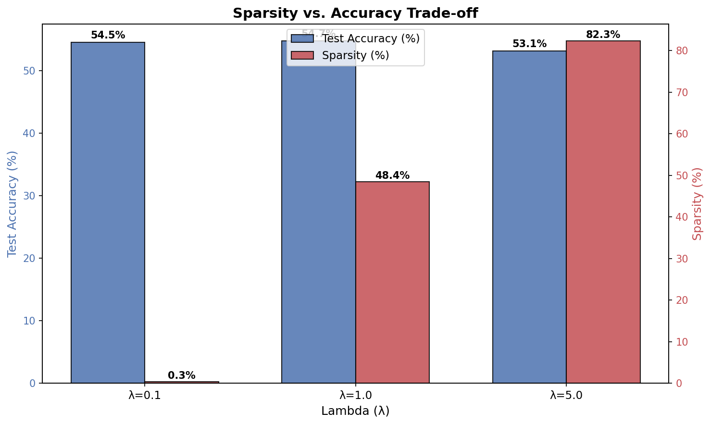
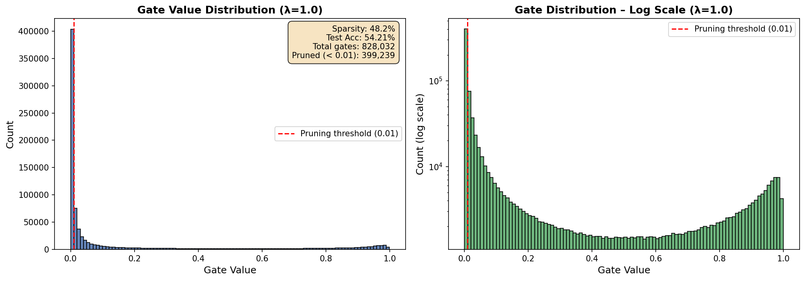
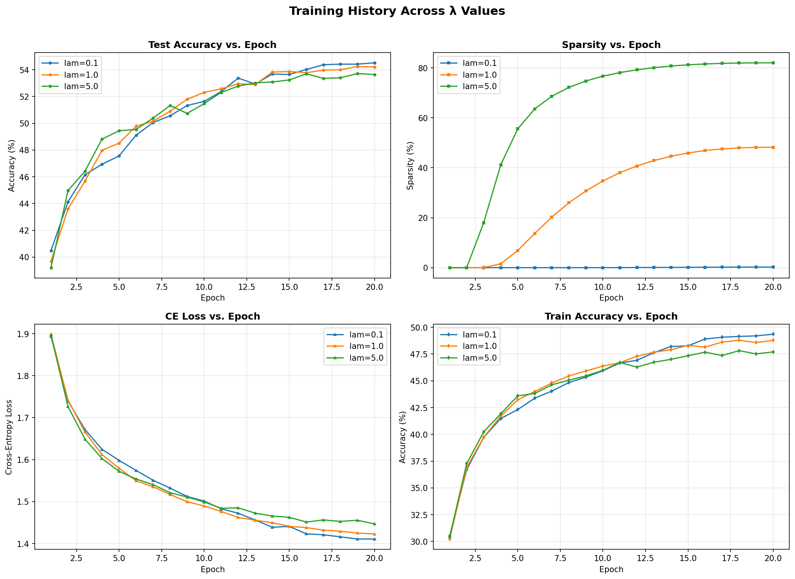

# self_pruning_network
self-pruning neural network trained on the CIFAR-10 image classification dataset. This network uses learnable gate parameters to identify and dynamically remove its own weakest connections during the training process.
Deep learning models are often large and computationally expensive.
This project implements a self-pruning neural network that automatically removes unnecessary weights to reduce model size and improve efficiency while maintaining performance.
Problem Statement
Modern deep learning models are heavily over-parameterized, making them computationally expensive to traverse and deploy to resource-constrained environments. Traditional network pruning relies on a costly "train, prune, and fine-tune" cyclic pipeline. 

The challenge: Can we design a neural network that dynamically identifies and prunes its redundant connections during a single training run, without suffering massive drops in accuracy?
 Approach
Instead of post-training pruning, we integrate dynamic learnable pruning gates directly into the model architecture:
1. Prunable Linear Layers: Each dense layer is equipped with learnable `gate_scores` of the exact same dimension as its weight matrix. 
2. Sigmoid Mapping: We apply a `Sigmoid` function to these gate scores to map them continuously into a `(0, 1)` range. We then multiply them element-wise against the standard weights.
3. L1 Penalty Regularizer: We penalize the network against active gates using an L1 norm regularization. Because L1 exerts constant pressure towards zero and the sigmoids snap to an absolute zero, the network natively creates a clean, bimodal gate distribution, selectively severing less useful connections organically.
Results
The network was trained on the **CIFAR-10** image classification dataset using a 4-layer MLP configuration. By controlling the sparsity penalty ($\lambda$), we demonstrated a highly scalable architectural flexibility:

| Range | Sparsity Penalty ($\lambda$) | Test Accuracy | Sparsity | Impact Summary |
|---|---|---|---|---|
| Weak | 0.1| 54.52% | 0.2% | The network ignores the penalty, acting as a baseline MLP. |
| Optimal | 1.0 | 54.21% | 48.2% | Sweet spot: Slashes network size in half with ~0 performance cost! |
| Aggressive | 5.0 | 53.64% | 82.0% | Extreme optimization: 82% of weights removed while only dropping ~1% accuracy. |

 Screenshots & Visualizations

 1. Sparsity vs. Accuracy Tradeoff
As the regularization penalty increases, the network shrinks drastically while maintaining incredibly rigid accuracy margins.
 

2. Learnable Gate Distribution (Bimodal Behavior)
Observe the distinct "bimodal" pattern where the network has independently determined which connections should be definitively shut off (0.0 spikes) and which are vital for analysis (1.0 spikes).
 

3. Training & Validation Progression
Continuous training metrics depicting the synchronized growth of classification accuracy alongside sparsity over the learning lifecycle.
 

How to Run
git clone https://github.com/ts3363/self_pruning_network
cd self_pruning_network
pip install -r requirements.txt
python train.py
Future Improvements
Structured pruning
Hardware-aware optimization
Deployment on edge devices
